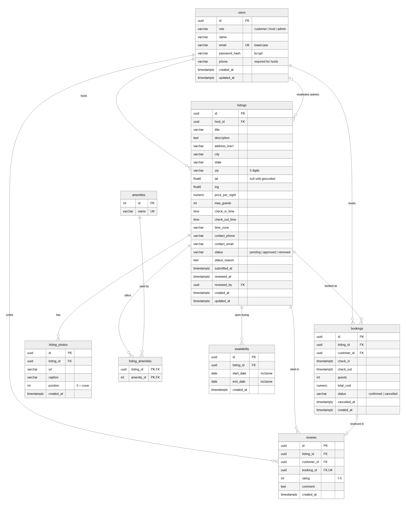
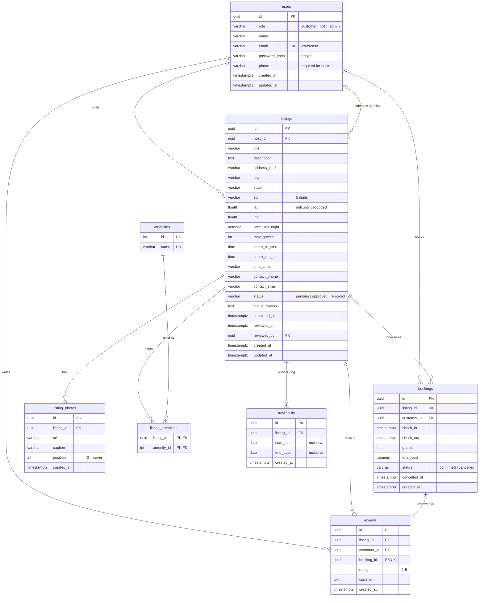

# Database schema

PostgreSQL 17, managed with Flyway. The migrations live in
[`api/src/main/resources/db/migration`](../api/src/main/resources/db/migration) and are the
source of truth. This page explains them. Issue #2.



## Conventions

- **Keys**: every table uses a `uuid` primary key (`gen_random_uuid()`), except `amenities`,
  which is a small lookup table with an integer key. IDs go out in JSON as strings.
- **Time**: instants are `timestamptz`, stored and returned in UTC (ISO 8601). House hours
  (`check_in_time`, `check_out_time`) are local times in the listing's `time_zone`.
- **Money**: `numeric(10,2)`, USD.
- **Enum-like columns** (`role`, `status`) are lowercase text limited by a `CHECK`, so the
  database holds exactly the values the API sends: `"host"`, `"approved"`, `"cancelled"`.
- **Soft delete**: listings are never deleted. Removing one sets `status = 'removed'`.

## Tables

| Table | What it holds | Notes |
|---|---|---|
| `users` | Customers, hosts and admins | `role` ∈ customer / host / admin. `email` is unique and stored lowercase. Only the bcrypt `password_hash` is stored. Hosts must have a `phone` (#6). |
| `listings` | Rentals | `status` ∈ pending / approved / removed. Address: `address_line1`, `city`, `state`, `zip` (5 digits), `lat`, `lng` (null until geocoded). `price_per_night`, `max_guests`, house hours, `time_zone`, contact details. `status_reason`, `reviewed_at` and `reviewed_by` record the admin decision (#24, #25). |
| `listing_photos` | Photo URLs for a listing | `position` sets the order, and 0 is the cover photo (#22). Deleted with the listing. |
| `amenities` | The predefined amenity list | Filled by migration V2. Hosts pick from this list (#22). |
| `listing_amenities` | Listing ↔ amenity join | Composite primary key. |
| `availability` | Date ranges a listing can be booked | `start_date` and `end_date` are both inclusive. Dates outside every window are blocked (#21). |
| `bookings` | Reserved stays | `check_in` / `check_out` as UTC datetimes, `guests`, `total_cost`, `status` ∈ confirmed / cancelled, `cancelled_at`. |
| `reviews` | 1–5 star reviews | At most one per booking (`booking_id` is unique). |

## Rules the database enforces

- **No double booking.** The exclusion constraint `bookings_no_overlap` rejects two
  *confirmed* bookings on the same listing whose `[check_in, check_out)` ranges overlap.
  Back-to-back stays are allowed, and cancelled stays release their dates. A violation
  raises SQLSTATE `23P01`, which the API returns as `409 CONFLICT` (#17). This relies on the
  `btree_gist` extension, which V1 creates. It is available on Amazon RDS.
- `check_out > check_in`, `guests >= 1`, `rating` between 1 and 5, `price_per_night > 0`,
  `zip` must be 5 digits, and `cancelled_at` is set exactly when `status = 'cancelled'`.

These rules stay in the API layer, with the error format in [api-contract.md](api-contract.md):
the 14-night limit, guests ≤ `max_guests`, stays inside an availability window, and only
approved listings in search.

## Running the migrations

```bash
cd api
docker compose up -d                                        # local Postgres 17
./mvnw spring-boot:run -Dspring-boot.run.profiles=migrate   # apply migrations, then exit
```

Any normal start (`./mvnw spring-boot:run`) also applies pending migrations first. Hibernate
then runs with `ddl-auto=validate`, so the app refuses to start if the JPA entities in
`dev.stayfinder.api.domain` drift from the schema.

To change the schema, add a new `V<n>__description.sql` file. Never edit a migration that
has already been pushed.

## Diagram source

GitHub renders this Mermaid block. `er-diagram.png` above is an export of it.


