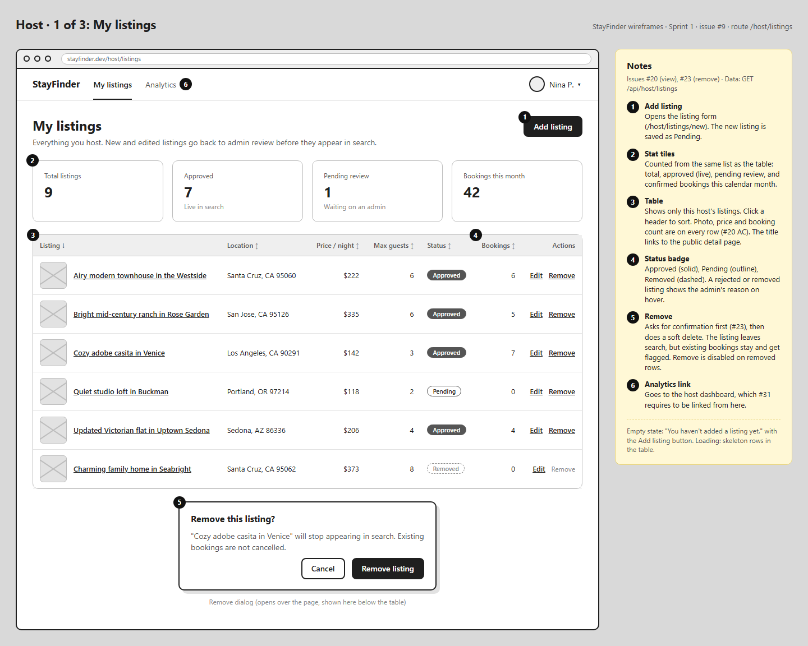
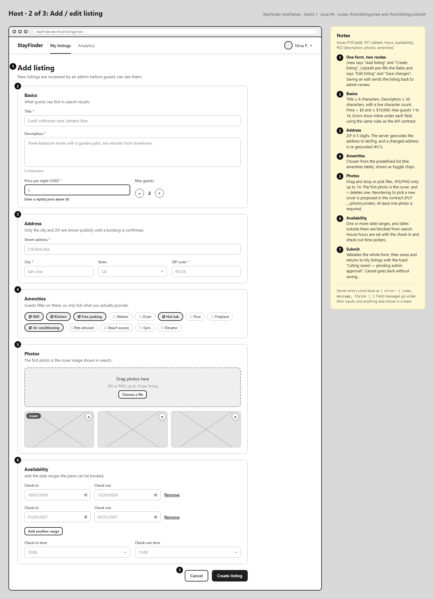
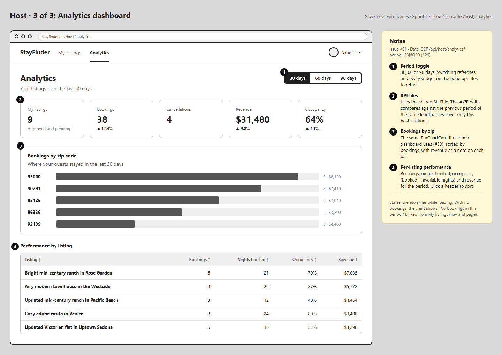

# Host wireframes

Low-fidelity layouts for the host screens (issue #9). They are greyscale on purpose, so the
review is about layout and behaviour rather than styling. The numbered markers match the
notes panel beside each screen.

| Screen | Issues | Route |
|---|---|---|
| [My listings](my-listings.png) | #20, #23 | `/host/listings` |
| [Add / edit listing](listing-form.png): details, address, amenities, photos, availability | #19, #21, #22 | `/host/listings/new`, `/host/listings/:id/edit` |
| [Host analytics dashboard](host-analytics.png) | #31 | `/host/analytics` |





## Editing

The sources are plain HTML and CSS in `src/`. Open one in a browser, change it, then re-export
the PNG at 1440px wide, for example with headless Edge or Chrome:

```bash
msedge --headless=new --hide-scrollbars --window-size=1440,1200 --screenshot=my-listings.png src/my-listings.html
```

Set the height to the page height (1152, 1984 and 1019 px for the current three).
